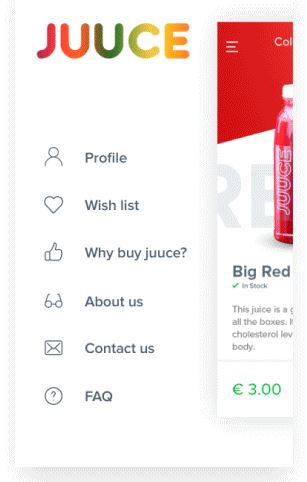
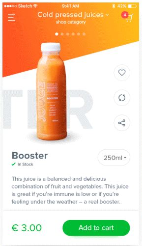
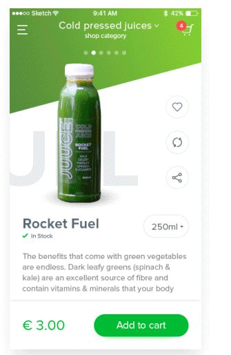

# \#UIToCode: JUUCE App
This is a product card concept for IOS, It was found at UpLabs and the credit for the design is to [Sergii Petakh](https://dribbble.com/sergiipetakh). Here is the [Concept](https://ios.uplabs.com/posts/juuce-app-product-card-animation) and here the [:video_game: Working Prototype](http://codepen.io/emoreno911/pen/vyJvpB) on [CodePen](http://codepen.io).

<table>
  <td style="border:"></td>
  <td style="border:none"></td>
  <td style="border:none"></td>
</table>

### Tricks
- **Sidebar transition**
	There are two main divs for the layout [sidebar & content], the content div is over the sidebar so, to obtain the desired animation just use the transform property to translate and scale the content.
- **App title gradient**
	Use the -webkit-background-clip property
- **Triangle div**
	https://css-tricks.com/snippets/css/css-triangle/
- **Background gradient transition**
	This is possible by using two divs(layers), the bottom one is a linear gradient from Black to White, the top layer has the color you would like to show with the alpha set to 0.7 and the transition property setted for background-color.
- **Slider**
	Based on Tobias Reich's [Pen](http://codepen.io/electerious/pen/JXNEPr)
- **Fonticons**
	Font generated by [flaticon.com](http://www.flaticon.com). Under [CC](http://creativecommons.org/licenses/by/3.0/): [Madebyoliver](http://www.flaticon.com/authors/madebyoliver), [Freepik](http://www.freepik.com), [Naseer Ahmed](http://www.flaticon.com/authors/naseer-ahmed).

### Update
JQuery was replaced with DOMtastic. Hammer.js was included to detect and handle swipe events.
