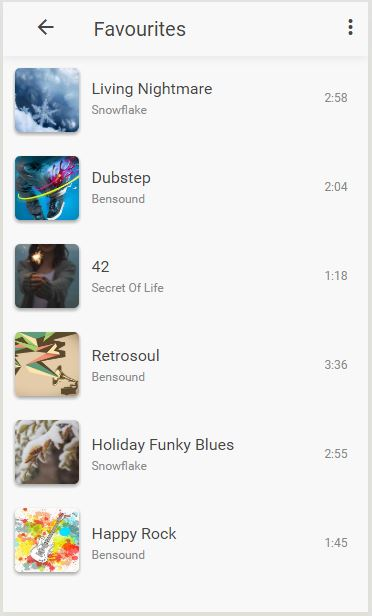
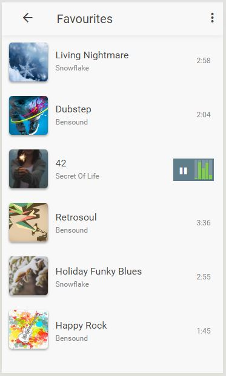

# \#UIToCode: Material Music
UIToCode is back in town and it comes supercharged with this music app concept from [Vitaly Silkin](https://material.uplabs.com/posts/material-music). It's supercharged because I add some UI and UX improvements to make this good design even better and it's also fully functional.

Here is the [Concept](https://material.uplabs.com/posts/material-music) and here the [:video_game: Working Prototype](http://codepen.io/emoreno911/pen/zNMOew) on [CodePen](http://codepen.io).

<table>
  <td style="border:none"></td>
  <td style="border:none"></td>
  <td style="border:none"></td>
</table>

### Tricks
- **List to Cover Animation**
	Basically is a transition in size and position of the image but as simple as it sound there's a tricky part, the position property has to be absolute and top-left values must be setted with the initial position of the image or you won't have any transition when you change the class.
- **Animation's Timing and Sync**
	When you select a song of the list and the player opens theres a nice effect on the controls of appear and expand, in that moment various animations could be activated but you can't trigger all at same time, to avoid this you could use setTimeout to add/remove the classes on the desired order.
- **Boundary Deform**
	Here I made it simple, the cover in the player is composed by two divs one with the top half and the other with the bottom half of the image then when the pan event is fired I handle the translate and skew transforms to create that pull effect on the correct border.
- **Audio API (JS)**
	I made a little plugin to encapsulate the basic functionalities of a custom audio player using this bible https://developer.mozilla.org/en-US/docs/Web/Guide/HTML/Using_HTML5_audio_and_video
- **FFT analyser (JS)**
	[Here](http://www.developphp.com/video/JavaScript/Analyser-Bars-Animation-HTML-Audio-API-Tutorial) you can see how a basic HTML5 FFT analyser works. Important: To avoid the cross-domain restriction you have to set the crossOrigin attribute of the player to 'anonymus' and also the response file has to contain the crossOrigin header in it.
- **Current song list indicator**
	It's an UX improvement to keep the user informed about the current playing song while he/she is on the list.
- **Songs**
	Royalty free music from [Bensound](http://bensound.com/), [Living Nightmare and Holiday Funky Blues](http://dig.ccmixter.org/files/snowflake) by snowflake (c) copyright 2016 Licensed under a Creative Commons license.
- **Images for Covers**
	[Pexels.com](http://pexels.com/)
- **Fonticons**
	[Material Design Iconic Font](http://zavoloklom.github.io/material-design-iconic-font/icons.html) created by Sergey Kupletsky
