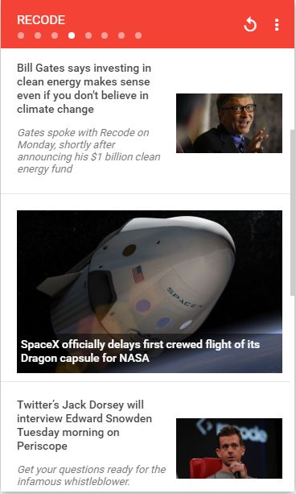
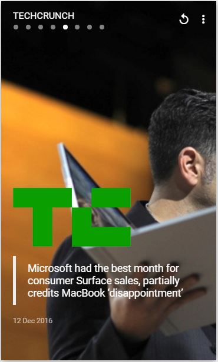

# \#UIToCode: News App
A news app inspired by [Jaret Zen](https://dribbble.com/JaretZen) here you can transition between the featured news by swipping right or left, or by clicking on any of the slider indicators, if you swipeup on a featured article the app will show you more news for that source. Click on the header to go back to the headlines.

Here is the [Concept](https://material.uplabs.com/posts/news-app-4b47c474-3bfb-4f75-872c-70c26637f25c) and here the [:video_game: Working Prototype](http://codepen.io/emoreno911/pen/BQMYja) on [CodePen](http://codepen.io).

<table>
  <td style="border:none"></td>
  <td style="border:none"></td>
  <td style="border:none"></td>
</table>

### Tricks
- **Headlines layout**
	Each headline has the full container height and its children are positioned with flex-end
- **Headline Background transition**
	For the parallax-esque effect when you swipe left or right just apply a transition to the _background-position_ property when the slide is going to be active, also the background-image property has to be setted to _cover_
- **Headline to content transition**
	Both containers have the same height as the main wrapper(610px) so to switch between headline and content, and viceversa, you have to use translateY() with the transition property setted for transform.
- **Blur filter**
	Apply a CSS filter to the .backdrop div. More info about CSS filters [Here](https://css-tricks.com/almanac/properties/f/filter/)
- **Dynamic Slider (JS)**
	In my last prototype I used a pure CSS slider (maybe 90% pure css), which turns to be very static because you have to modify the css file if you want to include more slides apart from the original 3. This time I put most of the slide functionality on JS code in order to support a variable qty of slides then no matter how many sources you have for the slider. 
- **API for test data**
	For this prototype the data was provided by [Newsapi.org](https://newsapi.org/)
- **Fonticons**
	[Material Design Iconic Font](http://zavoloklom.github.io/material-design-iconic-font/icons.html) created by Sergey Kupletsky
