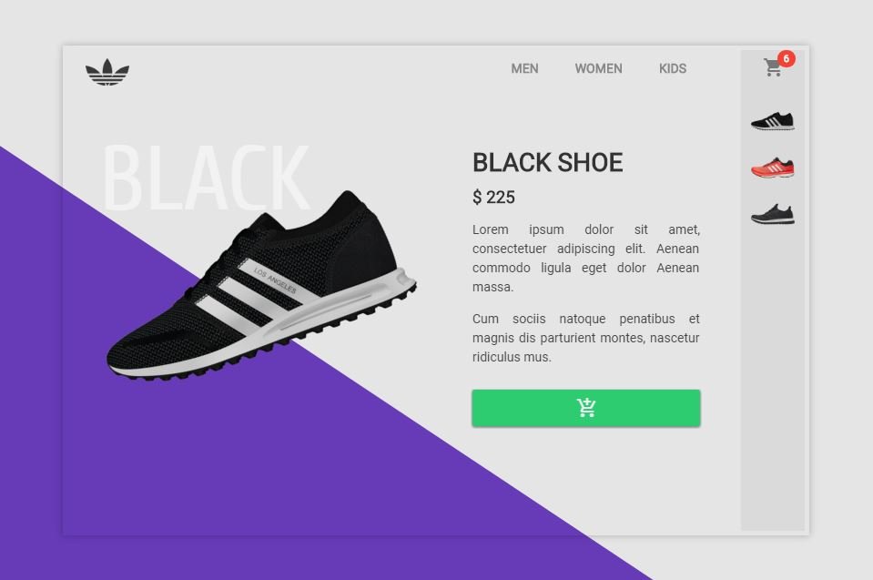

# \#UIToCode: Shoe Shop
An eshop inspired by [Youssef Eid](https://site.uplabs.com/youssefeid), to this cool design I have added a carousel with 3D transitons when you navigate between shop items. You can also add items to the cart.

Here is the [Concept](https://site.uplabs.com/posts/yeezy-boost) and here the [:video_game: Working Prototype](https://codepen.io/emoreno911/pen/Gmjgvb) on [CodePen](https://codepen.io).

### Tricks
- **Flexbox**
	To position the elements of the design has been used Flexbox in its majority since it allows to center them and to organize them easily.
- **Triangular Background**
	To achieve this effect there are two options, the first one (which is compatible with webkit and firefox with svg) is using the clip-path property to delimit the background to the desired triangular shape and the other one that is not so elegant but compatible with all browsers is applying the transparent edges trick like [here](https://css-tricks.com/snippets/css/css-triangle/)
- **Carousel with 3D transition**
	The markup is similar to a basic carousel but this time it was given a twist using "CSS 3D Transforms". The science here is to construct a polygon where the number of sides of it equals the number of elements contained in the carousel and make the transitions by rotating the polygon on the Y axis. More details [here](https://desandro.github.io/3dtransforms/docs/carousel.html)
- **Add to cart Animation**
	A simple animation fired when you press he add to cart button. See the styles for the "badge" class at style.css
- **Fonticons**
	[Material Design Iconic Font](http://zavoloklom.github.io/material-design-iconic-font/icons.html) created by Sergey Kupletsky

